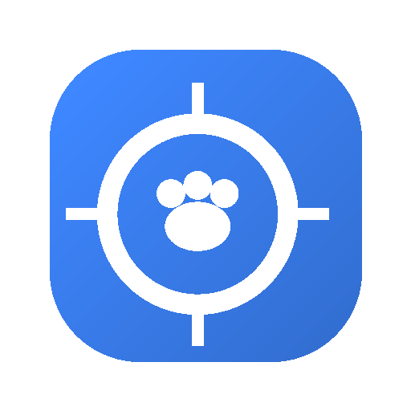

<p align="center">
  
</p>

<h1 align="center">Pawshot</h1>

<p align="center">
  <strong>軽量でオープンソースな macOS 用スクリーンショットツール。</strong><br>
  キャプチャ、注釈、共有 — すべてメニューバーから。
</p>

<p align="center">
  <a href="README.md">English</a>
</p>

<p align="center">
  
  
  
</p>

---

## 機能

- 📸 **範囲キャプチャ** — 画面の任意の領域を選択 (`⌘⇧4`)
- 🪟 **ウィンドウキャプチャ** — クリックで特定のウィンドウを撮影 (`⌘⇧5`)
- 🖥️ **フルスクリーンキャプチャ** — 画面全体を撮影 (`⌘⇧3`)
- 🔍 **フローティングプレビュー** — コピー・保存・編集がすぐできるサムネイル
- ✏️ **注釈エディタ** — 矢印、図形、テキスト、ハイライト、ぼかし、モザイク、トリミング
- 📤 **柔軟なエクスポート** — PNG、JPEG、WebP 形式に対応
- 🔘 **メニューバーアプリ** — Dock を汚さず、メニューバーに常駐

## スクリーンショット

> _準備中_

## はじめに

### 必要環境

- macOS 13.0（Ventura）以降
- 画面収録の許可

### Swift Package Manager でビルド

```bash
swift build
```

### Xcode でビルド

```bash
# xcodegen をインストール（未導入の場合）
brew install xcodegen

# プロジェクトを生成して開く
xcodegen generate
open Pawshot.xcodeproj
```

### App Bundle の作成

```bash
swift build
mkdir -p Pawshot.app/Contents/MacOS
cp .build/debug/Pawshot Pawshot.app/Contents/MacOS/
cp Pawshot/Info.plist Pawshot.app/Contents/Info.plist

# 画面キャプチャ権限のためアドホック署名
codesign --force --sign - Pawshot.app
```

## 使い方

1. Pawshot を**起動** — メニューバーにアイコンが表示されます。
2. **権限を付与** — システム設定 > プライバシーとセキュリティ > 画面収録。
3. ショートカットキーまたはメニューバーアイコンから**キャプチャ**：

   | ショートカット | アクション |
   |----------|--------|
   | `⌘⇧3` | フルスクリーン |
   | `⌘⇧4` | 範囲選択 |
   | `⌘⇧5` | ウィンドウ選択 |

4. **フローティングプレビュー**が表示されます — コピー、保存、編集が可能。
5. **注釈エディタ**で矢印、図形、テキスト、ぼかし/モザイク、トリミングが使えます。

## 技術スタック

| コンポーネント | 技術 |
|-----------|------------|
| UI | SwiftUI + AppKit |
| キャプチャ | ScreenCaptureKit (macOS 14+)、CGWindowListCreateImage フォールバック |
| ホットキー | Carbon Events |

## プロジェクト構成

```
Pawshot/
├── PawshotApp.swift        # @main, MenuBarExtra
├── AppDelegate.swift        # AppKit 統合
├── Models/                  # データモデル
├── Services/                # キャプチャエンジン、クリップボード、エクスポート、ホットキー
├── Capture/                 # 選択オーバーレイ、ウィンドウピッカー
├── Editor/                  # 注釈エディタ、キャンバス、レンダラー
├── UI/                      # メニューバー、設定、フローティングプレビュー
└── Extensions/              # ヘルパー拡張
```

## ライセンス

MIT — 詳細は [LICENSE](LICENSE) をご覧ください。
